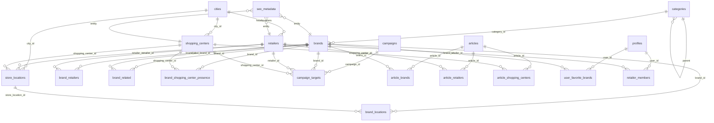

# Brands Serbia — Database Architecture

Production PostgreSQL schema for **Bilbord Brands** (retail discovery, not e-commerce).

**Migration file:** `supabase/migrations/001_production_schema.sql`  
**Supabase project:** [wbmvlooxrwdmqsyxfpia](https://supabase.com/dashboard/project/wbmvlooxrwdmqsyxfpia/sql)

---

## 1. ERD (Entity Relationship Diagram)



### Relationship summary

| From | To | Cardinality | Purpose |
|------|-----|-------------|---------|
| `brands` | `categories` | N:1 | Primary vertical |
| `brand_retailers` | brands ↔ retailers | N:M | Who distributes the brand |
| `brand_locations` | brands ↔ `store_locations` | N:M | Exact shelf presence |
| `store_locations` | `retailers` | N:1 | Physical shop unit |
| `store_locations` | `shopping_centers` | N:1 optional | Mall vs high-street |
| `campaign_targets` | campaigns → entity | N:1 polymorphic | Sale applies to brand/retailer/mall |
| `articles` | brands/retailers/malls | N:M | Editorial links |
| `seo_metadata` | any entity | 1:1 | SEO by `(entity_type, entity_id)` |

---

## 2. Tables (production)

| Table | Scale target | Notes |
|-------|----------------|-------|
| `categories` | ~50 | Tree via `parent_category_id` (e.g. footwear under fashion) |
| `cities` | ~200 | Normalized city search |
| `brands` | 10,000+ | UUID + unique `slug`, FTS `search_vector` |
| `retailers` | 5,000+ | Distributors / chains |
| `shopping_centers` | 500+ | Geo fields ready |
| `store_locations` | 20,000+ | Canonical physical store row |
| `brand_retailers` | 50,000+ | Verified distribution |
| `brand_locations` | 100,000+ | Brand at specific store |
| `campaigns` | 100,000+ | Date-range indexed |
| `campaign_targets` | 300,000+ | Polymorphic FK with CHECK |
| `articles` | 10,000+ | News / editorial |
| `seo_metadata` | per entity | `meta_title`, `meta_description`, `og_image`, `canonical_path` |

**Future (schema-ready):** `profiles`, `user_favorite_*`, `brand_claim_requests`, `retailer_members`, `sponsored_placements`

---

## 3. Indexes (highlights)

- **Unique slugs** on all public entities
- **Partial indexes** on `status = 'published'` / active campaigns
- **GIN** on `search_vector` (brands, retailers, malls, stores, campaigns, articles)
- **GIN trigram** on names for fuzzy fallback (`pg_trgm`)
- **Geo** `(latitude, longitude)` on malls and stores
- **Composite** `(status, start_date, end_date)` on campaigns

---

## 4. Query examples

### Brand by slug (detail page)

```sql
SELECT b.*, c.name AS category_name, c.slug AS category_slug,
       s.meta_title, s.meta_description, s.canonical_path
FROM brands b
JOIN categories c ON c.id = b.category_id
LEFT JOIN seo_metadata s ON s.entity_type = 'brand' AND s.entity_id = b.id
WHERE b.slug = 'diesel' AND b.status = 'published';
```

### Where is brand sold (retailers + stores)

```sql
SELECT r.name AS retailer, r.slug AS retailer_slug,
       sl.name AS store, sl.city, sl.address,
       sc.name AS mall, bl.verified
FROM brand_locations bl
JOIN brands b ON b.id = bl.brand_id
JOIN store_locations sl ON sl.id = bl.store_location_id
JOIN retailers r ON r.id = sl.retailer_id
LEFT JOIN shopping_centers sc ON sc.id = sl.shopping_center_id
WHERE b.slug = 'nike'
ORDER BY r.name, sl.city;
```

### Active campaigns for a shopping center

```sql
SELECT c.title, c.slug, c.start_date, c.end_date, c.campaign_type
FROM campaigns c
JOIN campaign_targets ct ON ct.campaign_id = c.id
JOIN shopping_centers sc ON sc.id = ct.shopping_center_id
WHERE sc.slug = 'usce'
  AND c.status = 'active'
  AND CURRENT_DATE BETWEEN c.start_date AND c.end_date;
```

### Global search (RPC)

```sql
SELECT * FROM search_directory('diesel usce', 20);
-- kolona za score: relevance (ne rank — rezervisano u PostgreSQL)
```

### Brands in category with pagination

```sql
SELECT b.slug, b.name, b.short_description
FROM brands b
JOIN categories c ON c.id = b.category_id
WHERE c.slug = 'fashion' AND b.status = 'published'
ORDER BY b.is_featured DESC, b.name
LIMIT 24 OFFSET 0;
```

---

## 5. Scalability notes

1. **UUID PKs** — safe sharding / merge; slug stays human URL.
2. **Denormalized `brand_shopping_center_presence`** — refresh via job when `brand_locations` change (avoid heavy joins on mall pages at scale).
3. **Campaign history** — at 100k+ rows consider **partitioning** `campaigns` by `start_date` (yearly).
4. **FTS** — `simple` config for Serbian Latin; upgrade to custom dictionary later.
5. **Counts** — use **materialized views** for retailer brand counts instead of per-request `COUNT(*)`.
6. **Storage** — `*_storage_path` maps to Supabase bucket `Photos` (`brands/`, `shopping-centers/`, …).
7. **RLS** — public read only published rows; writes via service role / Edge Functions.
8. **Read replicas** — Next.js reads from Supabase pooler; heavy admin ETL on service role.

---

## 6. Supabase compatibility

- Uses `gen_random_uuid()`, `auth.users` FK for `profiles`
- RLS enabled with public `SELECT` policies
- `search_directory()` exposed as RPC for client search
- Views: `v_published_brands`, `v_active_campaigns`
- Run migration in **SQL Editor** (single paste)

### After migration

1. Storage policy on bucket **Photos** (public read).
2. Update app repository to new table/column names (phase 2).
3. New seed script `npm run db:seed:v2` (to be added) — old seed targets deprecated schema.

---

## 7. Setup checklist

```text
[ ] SQL Editor → run 001_production_schema.sql (full file)
[ ] Storage → Photos → public SELECT policy
[ ] .env.local → SUPABASE_URL + keys (already set)
[ ] Seed data (v2 script or Supabase Table Editor)
[ ] Wire Next.js repository to new schema
```
